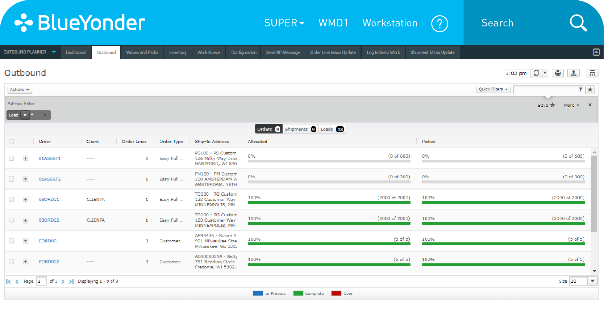
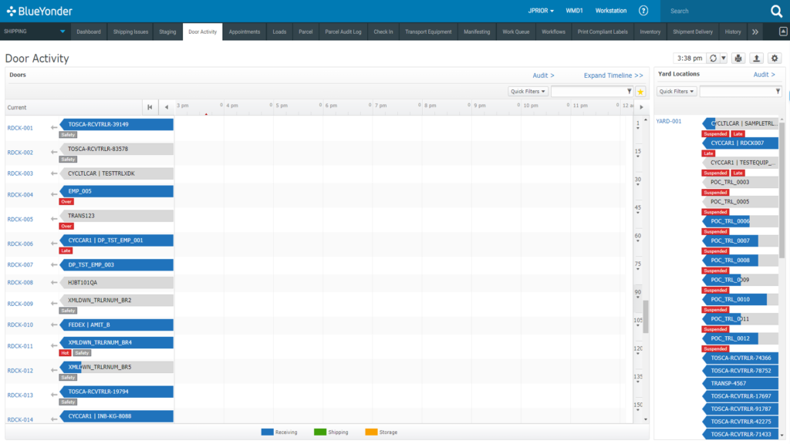
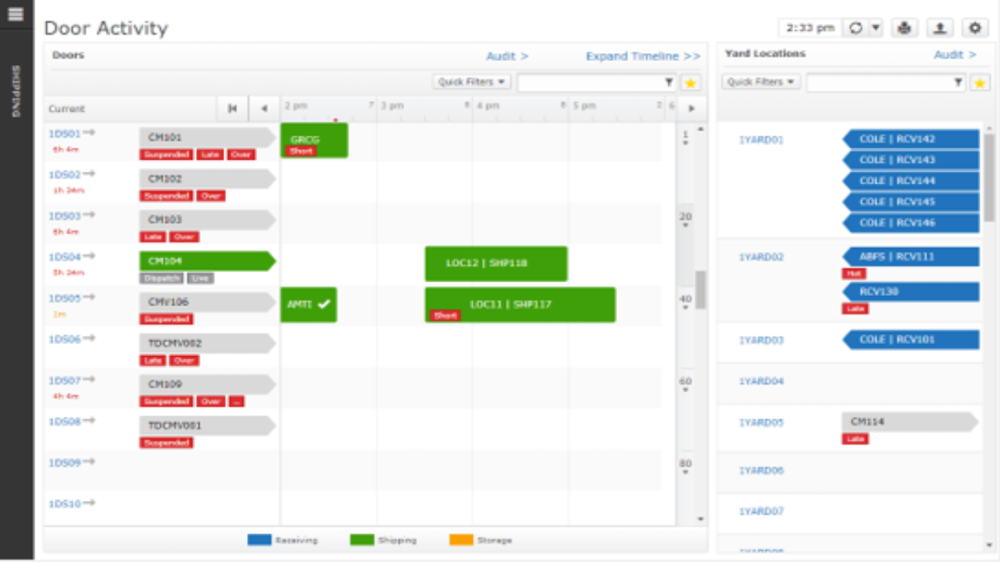

# Error Control and Transfering Data Between Sessions
Last summer I wworked for Driscoll's Berries as a shipping clerk, and became familiar with Blue Yonder, the company's Warehouse Management System (WMS). A WMS is used for a variety of purposes in a warehouse environment, including inventory and labor management as well as extensive details about inbound and outbound loads. The WMS we used was Blue Yonder.

One responsibility that often would fall to us shipping clerks would be directing trucks to numbered loading bays and assigning labor to load the trucks for outbound loads. Blue Yonder was awful in terms of **flexibility and efficiency of use** in this regard. You see, in order for a truck to be moved into a door on the system, it had to have had an appointment in the system for that specific time (within a half hour). Trucks can check in to the system without an appointment, but can't actually be assigned a door without one. The appointment had to have a door assigned to it, and no door can have more than one appointment at the same time, and even if a door is unoccupied, if there is an appointment at that time the system bars you from using the door unless that truck is the same one on the appointment. Because of the fast paced and rapidly changing envoronment, the doors and appointment time couldn't be confirmed that far ahead in advance. Just because the appointment on the system says a truck is being loaded on door 3 at 10 P.M. doesn't mean its getting loaded at that place and time, in fact there were maybe only 10 times accross thousands of orders that the appointments actually matched up. Confused yet? Below is what the screen in question looks like, the solid blocks are appointments.

This led us on wild goose chases of constantly having to change appointment times when trying to get trucks into doors, as the appointment times and doors in the system almost never matched what appojntment time and door a truck got in real life, and with the system preventing us from assigning mismatched doors and trucks, appointments had to be updated multiple times between checking the trucks in and actually getting them into a door.

The only **error recovery** is what I described above, but my proposed solution would allow an administrator to disable the requirement of having matching appointments for trucks backing into doorsand instead automatically dynamically update the appointment time to match when the truck backs into a door, that way this annoying issue could be resolved but still leaves the option for those who may need strict adherance to matching doors. 